# T790M-Spatial-Radiomics

**Intratumoral spatial-heterogeneity radiomics for noninvasive T790M prediction**

This repository is a cleaned, paper-aligned implementation of the spatial radiomics workflow described in:

> Zhou X†, Zheng J†, Ai H†, Yang C, Wang J, Sun Y, **Jin L\***. MRI-based radiomics for noninvasive prediction of T790M resistance mutation in lung cancer spinal metastases: an exploratory study. *Frontiers in Cell and Developmental Biology*. 2025;13:1673498. [doi:10.3389/fcell.2025.1673498](https://doi.org/10.3389/fcell.2025.1673498)

The pipeline captures intratumoral spatial heterogeneity from T1W and T2FS MRI through local entropy, patient-level superpixels, population-level subregions, radiomics, multicenter harmonization, reliability filtering, and leakage-aware feature selection.

Patient images, masks, clinical tables, trained models, and derived patient-level results are not included.

[`docs/SOURCE_MAP.md`](docs/SOURCE_MAP.md) maps the original ten-step analysis and downstream scripts to the cleaned public modules.

## Method

```mermaid
flowchart LR
    A[T1W and T2FS MRI] --> B[Expert lesion ROI]
    B --> C[9x9 local entropy]
    C --> D[ROI-wise Z-score: intensity + entropy]
    D --> E[30 patient-level superpixels]
    E --> F[Population clustering; candidate K = 2..10]
    F --> G[Spatial subregion maps]
    G --> H[PyRadiomics: subregions + whole tumor]
    H --> I[ComBat harmonization]
    I --> J[ICC > 0.80]
    J --> K[Mann-Whitney U + L1 logistic selection]
    K --> L[Logistic radiomics signature]
    L --> M[ROC / PR-AUC / calibration / SHAP]
```



The publication reported 1,967 radiomics features across first-order, shape, texture, and filtered-image families. The exact number emitted by code can vary with PyRadiomics version and valid ROI dimensionality.

## Repository layout

```text
T790M-Spatial-Radiomics/
├── configs/radiomics.yaml
├── examples/
├── t790m_radiomics/
│   ├── entropy.py          # ROI local entropy
│   ├── partition.py        # patient/population subregion construction
│   ├── radiomics.py        # subregion and whole-tumor extraction
│   ├── harmonize.py        # neuroHarmonize/ComBat wrapper
│   ├── reliability.py      # ICC(2,1) feature filtering
│   ├── modeling.py         # nested CV, Mann-Whitney, L1 logistic model
│   └── explain.py          # linear SHAP export
└── tests/
```

## Installation

Python 3.10 is recommended.

```bash
python -m venv .venv
source .venv/bin/activate
pip install -r requirements.txt
```

On Windows, activate with `.venv\\Scripts\\activate`.

## Input manifest

Use one row per case and MRI sequence:

```csv
case_id,sequence,image,mask,batch,label
demo_001,T1W,data/T1W/demo_001.nrrd,data/masks/demo_001.nii.gz,scanner_a,0
demo_001,T2FS,data/T2FS/demo_001.nrrd,data/masks/demo_001.nii.gz,scanner_a,0
```

The checked-in example contains synthetic identifiers and placeholder paths.

## Run

### 1. Construct spatial subregions

```bash
python -m t790m_radiomics.partition \
  --manifest examples/manifest.example.csv \
  --output-dir outputs/partition \
  --neighborhood 9 \
  --superpixels 30 \
  --candidate-k 2 3 4 5 6 7 8 9 10 \
  --population-method kmeans
```

The command fits each sequence separately, writes per-case labeled NRRD maps, and records CH/silhouette scores used to select the population-level number of subregions.

### 2. Extract radiomics

Add the generated `subregion_mask` paths to the manifest, then run:

```bash
python -m t790m_radiomics.radiomics \
  --manifest examples/radiomics_manifest.example.csv \
  --config configs/radiomics.yaml \
  --output outputs/radiomics_features.csv
```

### 3. Harmonize scanner effects

```bash
python -m t790m_radiomics.harmonize \
  --input outputs/radiomics_features.csv \
  --batch-column batch \
  --output outputs/radiomics_harmonized.csv
```

When evaluating a held-out cohort, estimate all preprocessing parameters from training data only. The standalone command is useful for exploratory analysis; nested evaluation should learn ComBat and feature-selection parameters inside each training fold.

### 4. Filter reproducible features

For repeated segmentations/extractions, supply a table with `case_id` and `rater` columns:

```bash
python -m t790m_radiomics.reliability \
  --input outputs/repeated_features.csv \
  --output outputs/icc.csv \
  --threshold 0.80
```

### 5. Train and validate the radiomics signature

```bash
python -m t790m_radiomics.modeling \
  --input outputs/radiomics_harmonized.csv \
  --id-column case_id \
  --label-column label \
  --output-dir outputs/model \
  --outer-folds 5 --inner-folds 5
```

Feature filtering and L1 logistic hyperparameter selection are fitted independently inside each outer fold. Optional external validation is available with `--external-csv`.

## Published results

In the published cohorts, the T1W+T2FS regional fusion model achieved AUCs of **0.916** in training, **0.867** in internal validation, and **0.839** in external validation. These values describe the paper cohorts and should not be treated as results of a fresh clone without the original data and protocol.

## Scope

This is a transparent research-code refactor of the original analysis scripts. It preserves the published algorithmic structure while replacing machine-specific paths and spreadsheet-by-spreadsheet operations with reusable modules. It is not a medical device and must not be used for clinical decisions.

## Author

**Lijun Jin (金利军)** · Corresponding author · [GitHub](https://github.com/June027)
